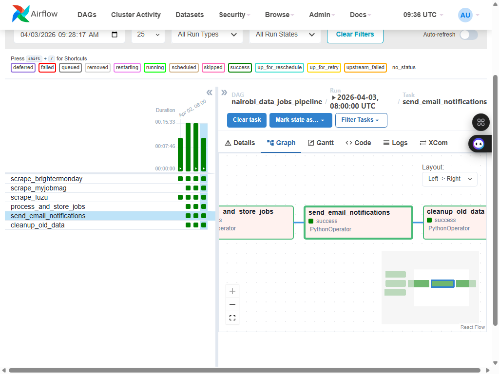
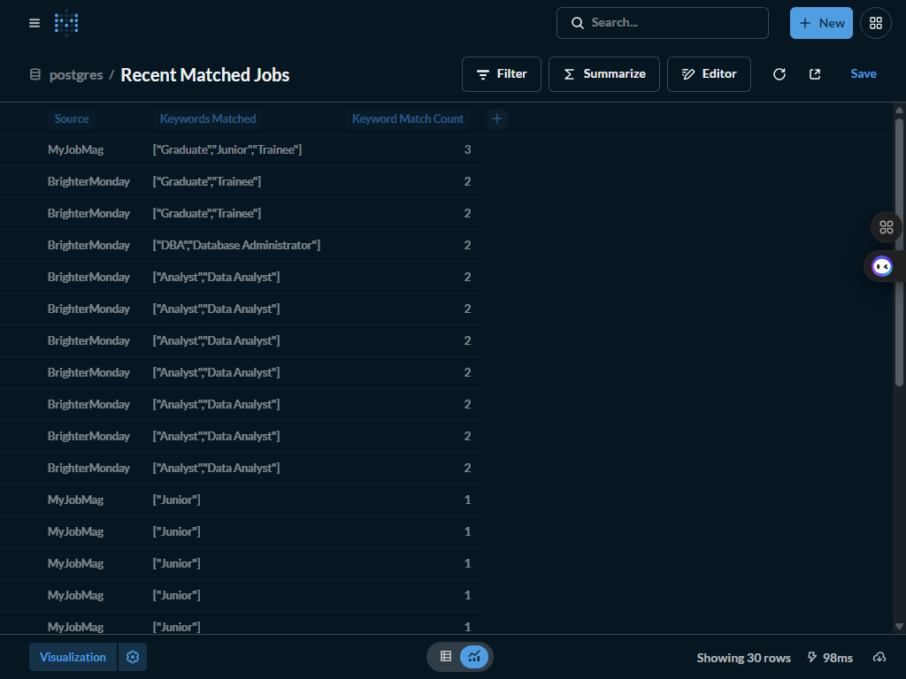
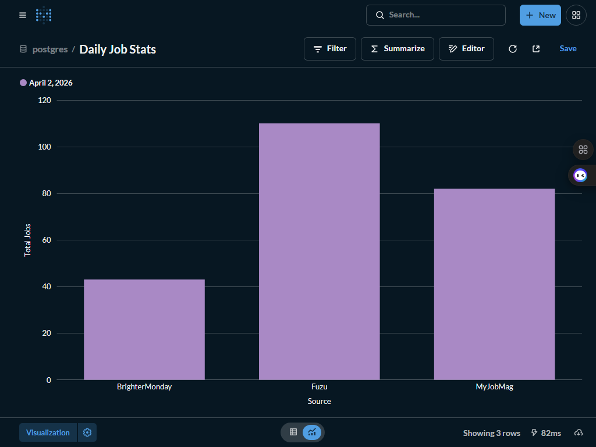
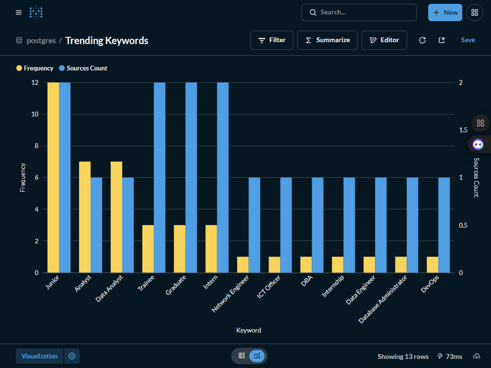
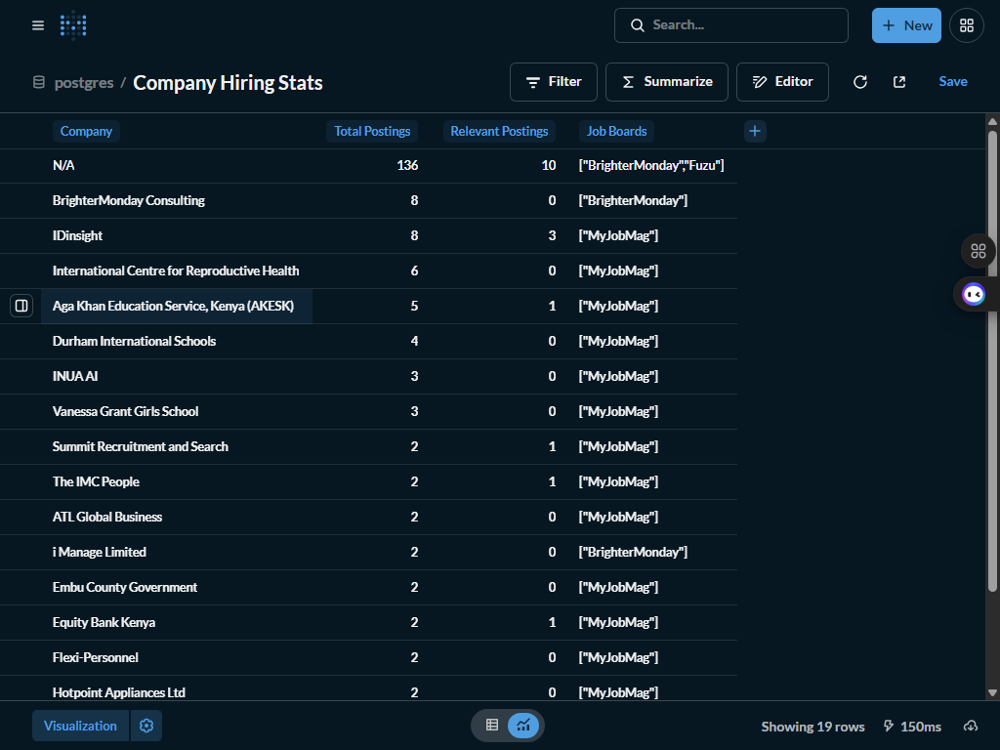

# 🗂️ Nairobi Data Jobs Tracker: Multi-Source Career Intelligence for Kenya's Data Sector

**Nairobi Data Jobs Tracker** is a production-grade data pipeline that bridges the gap between scattered Kenyan job boards and structured, keyword-ranked career intelligence. It scrapes three major platforms daily, normalises and scores every posting against 91 domain keywords across five career tracks, persists results to a PostgreSQL database with views and triggers, and dispatches an HTML email digest of the top matches — all orchestrated by Apache Airflow or run standalone with a single command.

---

## 🎯 Project Goal

Finding relevant data and IT roles in Nairobi requires monitoring BrighterMonday, MyJobMag, Fuzu, and more — each with different HTML structures, anti-bot protections, and update frequencies. Manually checking them daily is unreliable and time-consuming. This project automates end-to-end collection: a headless Playwright browser handles JavaScript-rendered SPAs and cookie-gated endpoints, a BeautifulSoup parser handles static HTML, and a weighted keyword engine scores every posting against five target domains (Data Engineering, Data Analysis/BI, IT, Graduate Programs, and Database Management). The result is a ranked, deduplicated feed of the most relevant open roles — delivered to an inbox every morning at 08:00 EAT.

---

## 🧬 System Architecture

1. **Ingestion Layer** — Three scrapers run in parallel as Airflow tasks or sequentially via `run.py`. **BrighterMonday** (React SPA) uses **Playwright** headless Chromium with API-response interception; falls back to `/listings/` HTML parsing. **MyJobMag** (server-rendered) uses **requests + BeautifulSoup** with retry logic. **Fuzu** attempts plain HTTP first; if blocked, falls back to **Playwright** with response interception.

2. **Normalisation Layer** — Each scraper passes output through shared `utils/helpers.py` functions: `clean_text`, `normalize_location`, `extract_salary`, `parse_date` (relative and absolute), and `validate_job_data`. All jobs are validated against required fields before any downstream processing.

3. **Keyword Matching Layer** — `KeywordMatcher` compiles 91 keywords into pre-built `re.compile` patterns with `\b` word boundaries and multi-word phrase support. `score_job` applies domain weights (role titles: 5, core tools: 2.5–3) and awards a 1.5× multiplier when a keyword appears in the job title. Jobs are sorted by weighted score.

4. **Storage Layer** — **PostgreSQL 17** stores all postings in a normalised schema with 7 indexes (including GIN for `TEXT[]` keyword arrays and full-text `tsvector`), 2 triggers (`update_updated_at`, `update_keyword_match_count`), 4 analytical views, and 2 stored functions. A **psycopg2** connection pool handles concurrent writes.

5. **Notification Layer** — **EmailNotifier** renders a templated HTML digest with keyword badges, job metadata, and direct apply links. Sent jobs are flagged `is_notified = TRUE` to prevent duplicate alerts. A separate `email_logs` table records every dispatch.

6. **Orchestration Layer** — An **Airflow DAG** (`nairobi_data_jobs_pipeline`) schedules daily runs at `0 8 * * *` (Africa/Nairobi), with parallel scraping tasks and a serial process/store/notify/cleanup chain. `run.py` provides the same flow without Airflow for local execution.

---

## 🛠️ Technical Stack

| **Layer**         | **Tool**                  | **Version** |
|-------------------|---------------------------|-------------|
| Scraping (SPA)    | Playwright (Chromium)     | 1.58.0      |
| Scraping (Static) | requests + BeautifulSoup  | 2.31 / 4.12 |
| HTML Parsing      | lxml                      | 6.0.2       |
| Keyword Matching  | Python re (compiled)      | stdlib      |
| Storage           | PostgreSQL                | 17-alpine   |
| DB Driver         | psycopg2-binary           | 2.9.9       |
| Notifications     | smtplib (Gmail SMTP/TLS)  | stdlib      |
| Dashboard         | Metabase                  | latest      |
| Orchestration     | Apache Airflow            | 2.10.5      |
| Containerisation  | Docker + Docker Compose   | latest      |
| Configuration     | python-dotenv             | 1.0.1       |
| Language          | Python                    | 3.11        |

---

## 📊 Performance & Results

- **235 jobs collected per run** across three sources (BrighterMonday: ~43, MyJobMag: ~82, Fuzu: ~110)
- **91 keywords** organised across 5 domains with domain-weighted scoring (max weight: 5)
- **~13% match rate** — keyword filter isolates relevant roles from broad Nairobi-wide listings
- **Full pipeline completes in ~4 minutes** (BrighterMonday: 90s, MyJobMag: 21s, Fuzu: 128s)
- **Zero schema drift** — `ON CONFLICT (posting_url) DO NOTHING` deduplicates across daily runs
- **7 indexes** including GIN on `keywords_matched TEXT[]` and `tsvector` full-text index for fast lookups
- **4 analytical SQL views** (`recent_matched_jobs`, `daily_job_stats`, `trending_keywords`, `company_hiring_stats`) queryable without application code

---

## 📸 Dashboard

The pipeline ships with a **Metabase** self-service BI layer connected directly to PostgreSQL. Four pre-built analytical views are available as soon as data is loaded — no additional SQL required.

**Recommended dashboards to build in Metabase:**

| **View / Table** | **Suggested Chart** | **What it shows** |
|---|---|---|
| `recent_matched_jobs` | Table with filters | Ranked list of open roles matching your target keywords |
| `daily_job_stats` | Grouped bar chart (date × source) | Daily scrape volume and match rate per job board |
| `trending_keywords` | Horizontal bar chart | Most-common matched keywords across all sources, last 30 days |
| `company_hiring_stats` | Table sorted by postings | Companies with 2+ active postings in the last 60 days |

**Airflow DAG run (all 6 tasks — success):**


*Full pipeline execution via Airflow: parallel scrape → process → notify → cleanup, all tasks green*

**Live Metabase dashboard screenshots:**


*`recent_matched_jobs` — ranked keyword-matched roles with source, score, and apply link*


*`daily_job_stats` — scrape volume per source per day, last 30 days*


*`trending_keywords` — most-common matched keywords across all sources, last 30 days*


*`company_hiring_stats` — companies with 2+ active postings in the last 60 days*

**Connect Metabase to PostgreSQL (one-time setup):**

1. Start the stack: `docker-compose up -d`
2. Open Metabase at **http://localhost:3000** (allow ~60s for first start)
3. Complete the setup wizard — create an admin account
4. At "Add your data", select **PostgreSQL** and enter:
   - **Host:** `postgres` (Docker service name)
   - **Port:** `5432`
   - **Database:** value of `DB_NAME` in your `.env` (default: `nairobi_jobs`)
   - **Username / Password:** values of `DB_USER` / `DB_PASSWORD` in your `.env`
5. Click **Connect** — Metabase will sync the schema and discover all tables and views
6. Navigate to **Browse Data → your database → Views** to start building questions from `recent_matched_jobs`, `daily_job_stats`, `trending_keywords`, and `company_hiring_stats`

---

## 📋 Monitored Job Boards

| **Board**       | **URL**                    | **Scraping Method**               | **Avg Jobs / Run** |
|-----------------|----------------------------|-----------------------------------|--------------------|
| BrighterMonday  | brightermonday.co.ke       | Playwright + HTML `/listings/` fallback | ~43          |
| MyJobMag        | myjobmag.co.ke             | requests + BeautifulSoup (5 pages) | ~82             |
| Fuzu            | fuzu.com/kenya/jobs        | requests → Playwright fallback    | ~110               |

---

## 🧠 Key Design Decisions

- **Playwright-first for SPAs, requests-first for static HTML:** BrighterMonday is a Vite/React SPA that returns a blank page to plain HTTP requests. Fuzu serves a 403 from nginx to non-browser clients. Playwright adds ~6–8s per query but is the only reliable path for these sites. MyJobMag is server-rendered, so the faster requests stack is preferred.

- **Dual scraping strategy with automatic fallback:** Fuzu attempts cheap plain HTTP first (session cookie priming + full `Sec-Fetch-*` headers); Playwright is invoked only if zero results are returned. This minimises browser overhead on runs where the HTTP path succeeds.

- **Pre-compiled regex patterns at initialisation:** All 91 keyword patterns (including multi-word phrases like `"Business Intelligence"` and aliases like `postgres`, `postgresql`, `psql` → `PostgreSQL`) are compiled once at `KeywordMatcher.__init__`. Per-job matching is pure `pattern.search()` with no recompilation overhead.

- **Title-boosted scoring:** A keyword match in the job title earns 1.5× the base domain weight, ensuring role-title matches like `"Data Engineer"` (weight 5 → 7.5 in title) rank above jobs that mention the term only in a requirements list.

- **PostgreSQL GIN index on `TEXT[]`:** `keywords_matched` is stored as a native PostgreSQL array, enabling `@>` (contains) and `&&` (overlaps) queries on keyword sets. The GIN index makes these O(log n) rather than full-table scans.

- **`ON CONFLICT DO NOTHING` deduplication:** `posting_url` carries a UNIQUE constraint. Daily re-scrapes are idempotent — no duplicate rows, no update logic, no diff tracking needed. Jobs that reappear simply do not insert.

- **`is_notified` flag over a join table:** Marking sent jobs at the row level keeps notification state co-located with the job record. The `email_logs` table records batch-level send metadata (recipient, subject, job IDs, status) for audit without requiring a many-to-many join for the common query "give me unnotified matched jobs."

---

## 📂 Project Structure

```text
nairobi-data-jobs-tracker/
├── config/
│   ├── __init__.py
│   └── settings.py              # All config classes (DB, Email, Scraping, Keywords, Airflow)
├── dags/
│   └── jobs_pipeline_dag.py     # Airflow DAG — parallel scrape → process → notify → cleanup
├── scrapers/
│   ├── __init__.py
│   ├── brightermonday.py        # Playwright + /listings/ HTML fallback
│   ├── fuzu.py                  # requests → Playwright fallback
│   └── myjobmag.py              # requests + BeautifulSoup (5 pages)
├── utils/
│   ├── __init__.py              # Re-exports all utility functions
│   ├── database.py              # DatabaseManager with connection pool, 15+ query methods
│   ├── email_notifier.py        # HTML digest builder + SMTP sender
│   ├── helpers.py               # clean_text, parse_date, extract_salary, validate_job_data
│   └── keyword_matcher.py       # KeywordMatcher with weighted scoring, 91 keywords
├── tests/
│   └── test_scrapers.py         # Unit tests for scrapers and matchers
├── assets/                      # Screenshots (Airflow DAG run, Metabase dashboards)
├── .env.example                 # All environment variables with descriptions
├── .gitignore
├── .dockerignore
├── docker-compose.yml           # 5-service stack: postgres + Airflow (init/scheduler/webserver) + Metabase
├── Dockerfile                   # python:3.11-slim + Playwright Chromium (standalone runner)
├── Dockerfile.airflow           # apache/airflow:2.8.4-python3.11 + Playwright Chromium (Airflow tasks)
├── quickstart.py                # Interactive setup checker (Python, DB, email, scrapers)
├── requirements.txt             # Full dependency set for standalone runner
├── requirements.airflow.txt     # Slim dependency set for Airflow image (excludes Airflow-bundled packages)
├── run.py                       # Standalone pipeline runner (no Airflow required)
└── setup_database.sql           # Full schema: tables, indexes, triggers, views, functions
```

---

## ⚙️ Installation & Setup

### Option A — Standalone (no Docker)

1. Clone the repository and create a virtual environment:
   ```bash
   git clone https://github.com/declerke/Nairobi-Data-Jobs-Tracker.git
   cd nairobi-data-jobs-tracker
   python -m venv .venv && source .venv/bin/activate   # Windows: .venv\Scripts\activate
   pip install -r requirements.txt
   playwright install chromium
   ```

2. Copy and configure the environment file:
   ```bash
   cp .env.example .env
   # Edit .env — set DB_PASSWORD, EMAIL_SENDER, EMAIL_PASSWORD, EMAIL_RECIPIENT
   ```

3. Apply the database schema (requires a running PostgreSQL instance):
   ```bash
   psql -U postgres -d your_database -f setup_database.sql
   ```

4. Run the pipeline:
   ```bash
   python run.py              # full run — scrape, match, insert, email
   python run.py --dry-run    # scrape and match only, no DB writes
   python run.py --source myjobmag   # single scraper
   ```

### Option B — Docker Compose

1. Copy and configure the environment file:
   ```bash
   cp .env.example .env
   # Edit .env — set DB_PASSWORD at minimum
   ```

2. Build and start services (PostgreSQL + pipeline runner):
   ```bash
   docker-compose up --build
   ```
   The schema is auto-applied on first start via `/docker-entrypoint-initdb.d/`.

3. Run the pipeline on demand:
   ```bash
   docker-compose run --rm runner python run.py --dry-run
   ```

### Option C — Airflow Orchestration (Docker)

The recommended way to run Airflow is via Docker Compose — no local Airflow installation needed.

1. Copy and configure the environment file:
   ```bash
   cp .env.example .env
   # Edit .env — set DB_PASSWORD at minimum
   ```

2. Build and initialise (one-time):
   ```bash
   docker-compose build airflow-init
   docker-compose up -d postgres airflow-postgres
   docker-compose run --rm airflow-init
   ```

3. Start all services:
   ```bash
   docker-compose up -d
   ```

4. Trigger the DAG manually or let it run on schedule (`0 8 * * *` Africa/Nairobi):
   ```bash
   docker exec <scheduler-container> airflow dags trigger nairobi_data_jobs_pipeline
   ```

> **Note:** The standalone `runner` service is on the `standalone` Docker Compose profile and will not start automatically. Use `docker-compose run --rm runner python run.py` to invoke it explicitly.

| **Service**     | **URL**                   |
|-----------------|---------------------------|
| Metabase        | http://localhost:3000     |
| Airflow UI      | http://localhost:8080     |
| PostgreSQL      | localhost:5432            |

---

## 📧 Email Notification Setup

Notifications are sent as an **HTML digest email** via Gmail SMTP/TLS. The email goes to the address set in `EMAIL_RECIPIENT` and is triggered once per pipeline run for any jobs with ≥1 keyword match that have not yet been notified.

**Required `.env` variables:**

```env
EMAIL_USER=your.gmail@gmail.com        # Gmail address used to send
EMAIL_PASSWORD=xxxx xxxx xxxx xxxx     # Gmail App Password (not your login password)
EMAIL_RECIPIENT=recipient@example.com  # Where the digest is delivered (can be same as EMAIL_USER)
ENABLE_EMAIL_NOTIFICATIONS=True
```

**Gmail App Password setup (required — Gmail blocks plain passwords):**

1. Enable 2-Step Verification on your Google account at [myaccount.google.com/security](https://myaccount.google.com/security)
2. Go to **Security → 2-Step Verification → App passwords**
3. Create a new App Password — select **Mail** and **Windows Computer** (or any device)
4. Copy the 16-character code (format: `xxxx xxxx xxxx xxxx`) into `EMAIL_PASSWORD` in your `.env`

**What the digest contains:**
- Subject: `[Nairobi Jobs] N New Job Matches — YYYY-MM-DD`
- HTML table of matched jobs with title, company, location, keyword badges, salary, and a direct **Apply** link
- Plain-text fallback for email clients that block HTML

If `ENABLE_EMAIL_NOTIFICATIONS=False` or credentials are missing, the `send_email_notifications` task completes silently with a return value of 0 — the pipeline continues normally without sending.

---

## 🗄️ Database Schema

Three tables, four views, two triggers, and two stored functions:

**Tables:**
- `jobs` — core posting record (20 columns including `keywords_matched TEXT[]`, `keyword_match_count`, `is_notified`, `metadata JSONB`)
- `scrape_logs` — per-source run record (start/end timestamps, jobs found/new/failed, duration, status)
- `email_logs` — per-digest send record (recipient, subject, job IDs, status)

**Views (queryable without application code):**
```sql
SELECT * FROM recent_matched_jobs;     -- active jobs with ≥1 keyword, last 7 days
SELECT * FROM daily_job_stats;         -- jobs/matches per source per day, last 30 days
SELECT * FROM trending_keywords;       -- keyword frequency + source spread, last 30 days
SELECT * FROM company_hiring_stats;    -- companies with ≥2 postings, last 60 days
```

**Triggers:**
- `update_jobs_updated_at` — sets `updated_at = NOW()` on every row update
- `update_jobs_keyword_count` — auto-syncs `keyword_match_count` from `array_length(keywords_matched, 1)` on insert/update

---

## 🎓 Skills Demonstrated

- **Multi-strategy web scraping** — Playwright headless Chromium for JavaScript SPAs (BrighterMonday, Fuzu) with automatic fallback to requests + BeautifulSoup for static HTML (MyJobMag); demonstrates selecting the right tool based on site architecture
- **Anti-bot evasion techniques** — cookie priming, full `Sec-Fetch-*` browser header replication, randomised delays, and session reuse to handle nginx/Cloudflare-protected endpoints
- **NLP-adjacent keyword scoring** — compiled regex patterns with `\b` boundaries, multi-word phrase support, domain category weighting, and title-boost multipliers
- **PostgreSQL advanced features** — GIN indexes on `TEXT[]` and `tsvector`, BEFORE INSERT/UPDATE triggers, `CREATE OR REPLACE VIEW`, stored functions with `RETURNS TABLE`, `ON CONFLICT DO NOTHING` upsert, JSONB metadata column
- **Connection pool management** — `psycopg2.pool.SimpleConnectionPool` with context-manager-based borrow/return, safe JSONB serialisation, and `RealDictCursor` for dict-native result sets
- **Apache Airflow DAG design** — parallel task fan-out (three scraper tasks) → serial fan-in (process → notify → cleanup), XCom for inter-task data passing, configurable retry/delay, task-level scrape logging; all 6 tasks validated end-to-end in Docker
- **Production pipeline patterns** — `ON CONFLICT` deduplication, `is_notified` state tracking, automated archival of 180-day-old records, log retention cleanup, `--dry-run` flag for safe testing
- **Docker containerisation** — two custom Dockerfiles (standalone runner + Airflow); 5-service `docker-compose.yml` with YAML anchors, health-check dependency chains, named volumes, profile-based service isolation, and `docker-entrypoint-initdb.d` schema bootstrap
- **Email automation** — SMTP/TLS with `smtplib`, MIME multipart HTML/plain digest, keyword badge rendering, per-job apply links, send status logging
- **Self-service BI with Metabase** — PostgreSQL views exposed as a zero-code analytics layer; demonstrates that production data models are consumable by non-engineers, a key expectation in data engineering roles
- **Modular Python architecture** — singleton pattern for DB/email/matcher instances, `__init__.py` re-exports for clean imports, separation of config / scrapers / utils / orchestration layers
